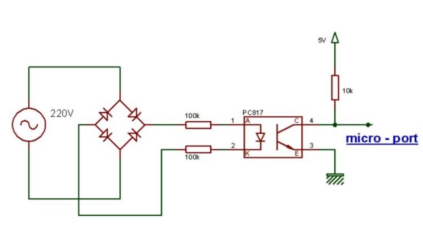

# IR-Controlled-Light-Dimmer
# Introduction
Dimmer in English: Dimmer is used to adjust the amount of voltage or brightness and in the automotive industry is called the switch to change the strong light (high light) and low light (low light).
Upon receiving the voltage, this device provides voltage from near zero to near the source voltage as output. Dimmers have different types and designs depending on the type of application.
Dimmers are available in AC and DC types, the dimmer uses an electronic component called a triac.
This device is used to increase or decrease the light of house lamps and areas where the light used varies. A dimmer is a variable resistor or potentiometer. It is installed in the circuit of the phase wire path (such as installing a single bridge switch). The dimmer structure has two contacts, one of which is the phase input point and the other is the phase output point. Since the dimmer controls the voltage, it is one of the methods of controlling the speed of electric motors, so the dimmer can be used as a speed controller for single-phase electric motors with low power, such as ceiling fan motors.
# Types of dimmers
* Resistance ( manual )
In this type of dimmer, the work of controlling and adjusting the fire angle of the triac is done by a resistor and a potentiometer. By turning the dimmer volume, the light of the lamp increases and decreases.
* Digital
In digital dimmer, the triac fire angle is controlled digitally by the processor and the keys Pressure or remote control is performed.

# Triac
Triac is a high-speed solid-state component that has the ability to switch and control the AC power of a sine waveform. The Triac acts exactly like two ordinary thyristors connected in parallel (back to back), and because of this structure, the two thyristors will have a common gate base. The input signal phase control controls the power average it delivers, although the triac is excited and turned on in both the positive and negative half-cycles of the 

# Digital dimmer control
•	There are a variety of control methods available today, including:
•	Control via button or key
•	•Touch control system
•	Remote control
o	Remote control (Wi-Fi or red Mauden)
o	Audio control system, response to specific audio signals
In this project, we intend to implement a digital dimmer that is controlled with an infrared remote control. 

# Different parts of dimmer design
A sub-digital digital dimmer consists of the following parts:
1  . Control circuit (microcontroller and remote control)
2 .  Zero crossing detector
3 .  Power circuit (for load control)
In the following, we will describe each of the sections.
Control circuit
 In order to transmit information through infrared, it is necessary to perform modeling. Because it was initially assumed that the number of keys was limited (two + and - keys to increase or decrease the light), we moved on to analog implementation.
 

 
 # Control circuit 
 
 In order to transmit information through infrared, it is necessary to perform modeling. Because it was initially assumed that the number of keys was limited (two + and - keys to increase or decrease the light), we moved on to analog implementation
 
  
  
  placed in the width of the pulse. By considering a monostable circuit for each switch separately (with different pulse widths, the pulse width is 30 milliseconds for the + key and 10 milliseconds for the - key). The generated pulses go to an XOR and its output goes to pin 4 of 555 timer (RESET pin) and causes one if the same pulse generated as the pulse generated at the output of the monostable, the stabilization circuit to turn on and a wave at its output. Create a square with the intended frequency. Here, due to the use of TSOP1138 as an infrared receiver, the stable circuit must produce a frequency of 38 kHz so that the receiver can detect it. After the pulse generated by the infrared transmitter was sent. In the receiver, after detecting the pulse at its output, it is placed at the LOW level equal to the width of the pulse, and if the output signal source is lost, it is placed at the High level. Finally, the output goes to the microcontroller with the following circuit, and after processing, it is detected which key is pressed.
  
  

# Zero Cross Detector

The function of Triac is to break the AC voltage, but if this voltage is broken by an improper point, the so-called lamp will flash. The best place to fail at zero moment is the voltage. For this purpose, an orbit is designed to identify this moment. So by passing this moment, a pulse is produced. This pulse is intermittently transmitted to the control unit, by detecting this micro moment after a certain time, it stimulates the Triac base, thus the Triac passes the voltage and turns on the lamp. There are various ways to do this, for example one of them is to use a comparator (operational amplifier). Its circuit is shown in the figure below.

  
  
There are several circuits that can do this. The circuit used in this project is below. The operation of the circuit is such that the city electricity is rectified after passing through the diode bridge and goes to the optocoupler. Yes, the diode is on ... the transistor goes to saturation, the output is zero, so we have a rising edge of the micro when this interrupt comes. After a certain period of time (depending on the amount of light we have adjusted by the switches) it produces a pulse at its output that goes to the power circuit.The amount of delay time of sending the command pulse actually determines the angle of fire in the circuit. This time can be adjusted by infrared remote control. In other words, these two switches play the role of the same volume control in a normal dimmer.

  
  
# Power circuit
 The pulse generated by the micro is given to the moc3021 gate and causes it to be excited. By turning on and turning on the diode, the current required to excite the Triac gate is generated by the other side and causes the current to pass through the lamp. Makes the circuit work properly. It is a command that comes here from the previous floor. That is, we must recognize the passage of zeros correctly and not miss any of them. In addition, it is designed to reduce noise and disturbing harmonics in a 100 nf capacitor and a 47 ohm resistor. As mentioned, Triac is used to control the load. Triac has the ability to control the power consumption of the lamp by cutting off the AC voltage. Triac after Triac by An excited pulse passes current. In the figure, at some point in the positive half-cycle of the input AC signal, the triac is cut off, then the triac gate is excited by a pulse and the triac is switched on and the current passes through the load. Diak is used to set up Triac. One of the important features of Diak is that when the current is turned on, it creates an instantaneous needle shape that is suitable for stimulating gates such as thyristors and triacs. This feature is used to generate a needle wave. Diak optocoupler can be used to prevent microcurrent flow.
 

P.S: there is a video of this project in Video Folder
